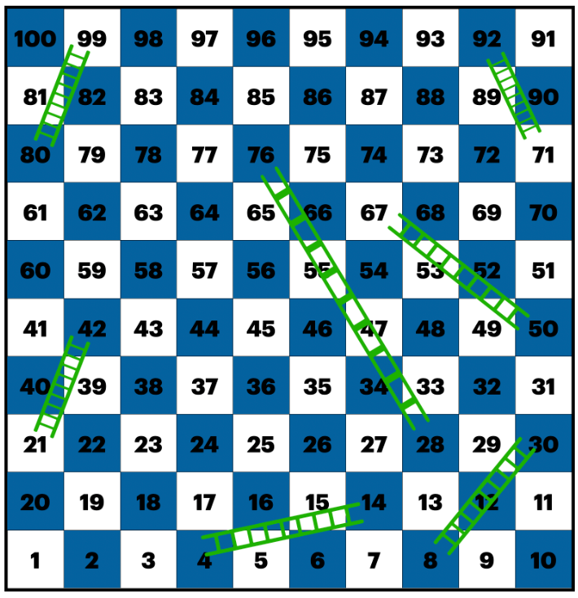

# 문제

OOO 회사에 입사 첫날, 예전 개발자가 만들다 멈춘 보드 게임에서 말의 움직임을 판단하는 코드를 공유해 주었다. 1번부터 시작하고 주사위를 굴려서 나온 숫자만큼 전진하는 보드 게임이다. 다음 보드 게임 이미지에서 사다리가 놓인 칸에 도착한 경우만 사다리를 타고 더 높은 숫자 칸으로 올라갈 수 있다.

주사위 숫자만큼 이동해서 도착할 위치를 계산하는 판단 조건과 변수 의미를 정리해서 기록한다.

# 공부

1. 자바스크립트 파일을 실행하기 위해서 써야 하는 명령어 
  - node "파일명"

2. new Array(100).fill(1)
  - 100개 크기의 리스트에 1을 채워넣어라
  - Array는 클래스이고 100이 constructor로 들어간다 fill은 함수로 1이 변수로 들어간것이다. 

3. Math.random()은 0 ~ 1까지의 수중 하나를 배출한다. 

4. Math.floor()는 내림 연산이다.

5. Math.random() * (구하고자 하는값) 을 하는 이유는 해당 값이 1/(구하고자 하는값)이라면 
(구하고자 하는값)을 곱했을때 (몫).xxx 이런식으로 나오기 때문이다 그래서 이걸 자바스크립트에 버림
을 이용하면 원하는 정수만 나오게 할 수 있다. 

# 해결 

1. 자바스크립트는 ==로 참과 거짓을 판별하는 것이 아닌 ===로 판별한다.

2. 중간에 정해둔 값에 오류가 있었다. 
  - 21, 71

3. 순서 변경
  - 관리하기가 쉽게 순서를 변경하였다.

4. (추가사항) 뱀에 위치에 따른 값을 추가하였다.

# 추가 의견

1. 100에 도착했을때 완주했다라는 이야기가 나오면 좋을것 같습니다.

2. 리스트를 이용해서 변수들을 관리하면 더 좋을것 같다는 생각을 하였습니다