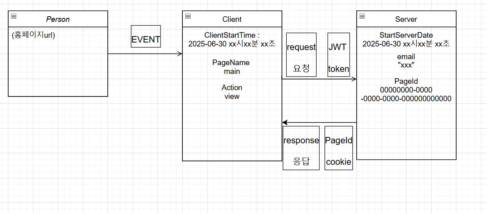
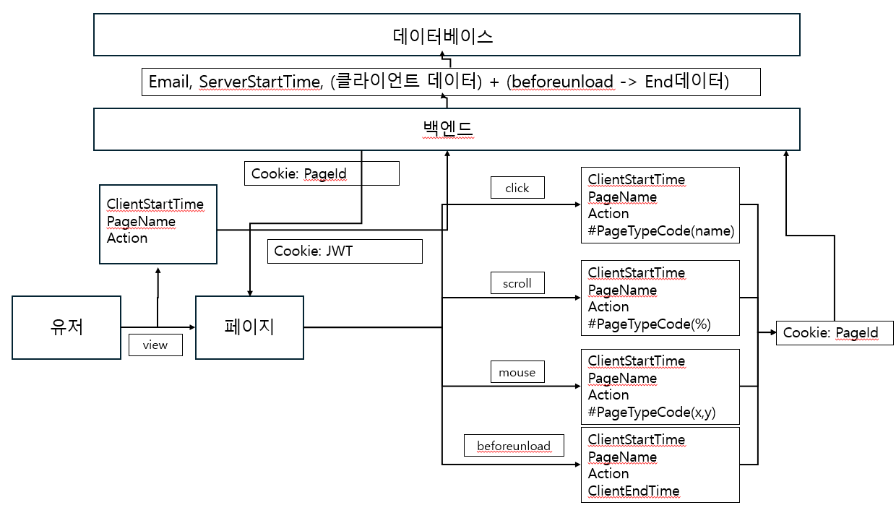

# 📊 데이터 설계


## 1. 데이터 구조 및 설명

| NAME             | TYPE     | DESCRIPTION                                                      |
|------------------|----------|------------------------------------------------------------------|
| Email            | string   | 유저의 이메일                                                   |
| ClientStartTime  | datetime | 유저가 클라이언트에서 행동을 시작한 시간                        |
| ServerStartTime  | datetime | 유저가 요청을 보냈을 때 서버가 행동을 시작한 시간               |
| PageName         | string   | 페이지 이름                                                     |
| PageTypeCode     | string   | 페이지의 종류를 나타내는 코드 번호                              |
| Action           | string   | 유저가 수행한 행동                                              |
| PageId           | uuid     | 해당 페이지의 고유 아이디                                       |
| ClientEndTime    | datetime | 유저가 해당 행동을 끝냈을 때의 클라이언트 측 종료 시간          |
| ServerEndDate    | datetime | 유저가 행동을 끝낸 후 서버에 값을 저장한 시점 (클라이언트 기준) |


## 2. 예시 시나리오: 유저의 페이지 진입 (view 행동)

  1. 유저가 페이지에 진입한 시점 

    - 사용자는 2025-06-30 xx시 xx분 xx초에 main 페이지에서  view   행동을 수행합니다.
    
  2. 클라이언트에서 데이터 생성 및 요청 전송

    - 클라이언트는 다음과 같은 JSON 데이터를 생성하여 서버에 요청을 보냅니다:
  ``` js
  {
    "StartClientDate": "2025-06-30 xx:xx:xx",
    "Page": "main",
    "Action": "view"
  }

  ```

  3. 서버에서 요청 수신 및 처리

    - 서버는 요청을 수신한 시점 (2025-06-30 xx:xx:xx)의 서버 시간을 기준으로 다음과 같은 처리를 수행합니다:
      
      * 요청한 유저의 이메일: "xxx"

      * 페이지 이름: "main"

      * 수행된 행동: "view"

      * 페이지 ID는 UUID로 랜덤 생성되며, 예:
      PageId: "550e8400-e29b-41d4-a716-446655440000" 




## 3. 데이터 수집 방법

### ✅ 1. URL 활용

  - 페이지 정보를 URL 파라미터에서 추출하여 수집합니다.
  - 예시: https://example.com/event&page=1 -> event 페이지의 1번 페이지를 보고 있음
  - & 구분자를 활용해 파싱 처리 예정

### ✅ 2. 쿠키 활용

  - 페이지 방문 시 생성된 PageId를 쿠키로 저장하여 추적합니다
  - SameSite=Lax 정책을 사용하여 페이지 간 요청에도 안정적으로 유지됩니다.
  - PageId=550e8400-e29b-41d4-a716-446655440000

### ✅ 3. 이벤트 리스너 활용

  - 특정 사용자 행동을 감지하여 수집 로직을 트리거합니다.
  - 예시:
    ``` js
      document.querySelector("button").addEventListener("click", () => {/** 수집 로직 */});
    ```

## 4. 데이터 구조 설계 이유

  1. Map 자료구조 사용 이유

    페이지마다 수집 항목이 다를 수 있기 때문에, 유연하고 빠르게 키-값 접근이 가능한 Map 구조를 사용합니다.

  2. 설계 목적

    사용자 행동을 추적할 때 누가(Email, PageId), 언제(Start/EndClient/ServerDate),어디서(PageName, PageTypeCode), 무엇을(Action) 수행했는지를 정밀하게 기록하기 위함입니다.

  3. Email / PageId 분리 이유

    로그인하지 않은 페이지도 고려하며, EndServerDate와의 연동 시 추적의 유연성을 위해 별도 필드로 유지합니다.

  4. Client vs Server 시간 분리 이유

    클라이언트 체류 시간 분석, 서버 지연 계산, 사용자 UX 측정 등을 위해 양쪽 시간을 모두 기록합니다.

  5. PageTypeCode 필드 이유

    동일한 URL이라도 페이지 구성(탭/뷰 등)에 따라 다른 식별이 필요할 수 있어 타입 분리를 위해 사용합니다.

  6. 쿠키 사용 이유

    LAX 쿠키를 통해 페이지 간 데이터 추적이 가능하며, 동일 페이지 내 행동 식별에 유리합니다.

## 🖼 시각적 예시



