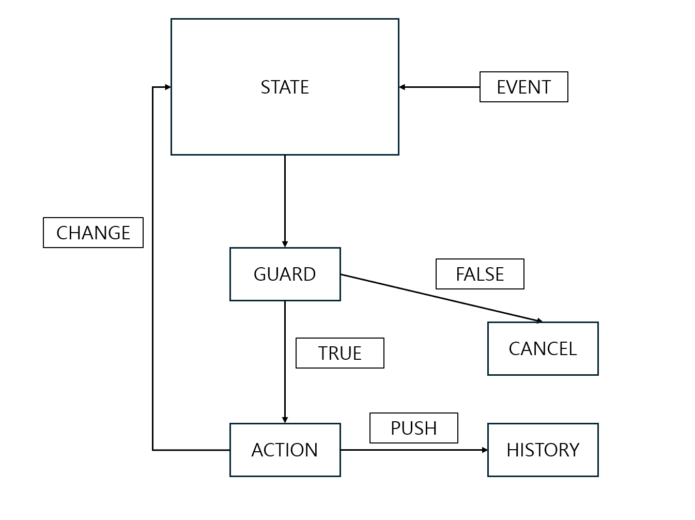
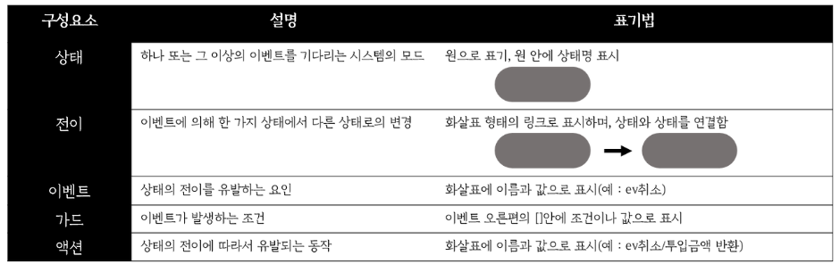

# 요약

### STATE -- EVENT -- GUARD -- ACTION --> STATE

  #### 예시설명
    
    1. 현재 상태가 IDLE일 때
    2. 이벤트 INVITE가 발생하면
    3. 해당 이벤트가 유효한지 검사(GUARD) 하고
    4. 상태 전이가 필요하다면 기록(ACTION) 한 후
    5. 다음 상태로 전이(STATE) 한다.

    

# 풀이

### 1. 상태 전환 다이어그램 이해

  -> 관련 문서와 영상을 통해 상태 전이 다이어그램의 개념과 구조를 학습함:
  - https://www.guru99.com/ko/state-transition-testing.html
  - https://www.youtube.com/watch?v=1Vinu58-RgY
  - https://www.youtube.com/watch?v=MDc1qGRyy6w

### 2. 상태 전이의 데이터 구조화

  -> 상태 전이를 비교문 대신 객체 기반의 데이터 구조로 관리하는 방식 학습

  -> ChatGPT를 통해 다양한 예시와 비유로 개념을 심화 이해함
  예시 프롬프트:
  - 상태 전이에 대해서 예시를 들어 설명해줘
  - 캐릭터를 방향키로 움직인다고 할 때, 방향키가 이벤트이고, 벽이 guard, 이동이 action 맞지?

### 3. 문제 분석 및 코드 작성

  #### 3-1. StateTransition 클래스로 구조화
    
    - this를 활용하여 현재 상태를 지속적으로 관리
    - 상태와 이벤트 처리 함수들을 묶어 객체 단위로 관리

  #### 3-2. STATE, EVENT, ACTION 함수는 단일 함수로 구성

    - 상태와 이벤트는 다이어그램 상에서 단순하고 명확하게 작동하므로 단일화 처리

    - 액션은 guard의 결과에 따라 수행되므로 상태 전이 기록(log)만 담당

  #### 3-3. GUARD 함수는 상태별로 분리하여 정의

    - 각 상태별 guard는 객체 형태로 관리 (EVENTMap)

    - 한복잡한 if문 대신 guard 함수를 상태별로 분리하여 가독성과 구조적 명확성 확보

  #### 3-4. ACTION 함수는 상태 전이 기록 및 변경 담당

    - ACTION 함수에서 history에 상태 전이 기록

    - 처음엔 guard 내부에서 상태 전이를 처리하려 했지만, 코드 복잡도를 낮추기 위해 ACTION 함수로 통합

### 4. 결과 출력

    - history 배열에 상태 전이 결과를 순서대로 저장

    - 최종 출력은 JSON.stringify를 활용하여 배열 형태로 출력

